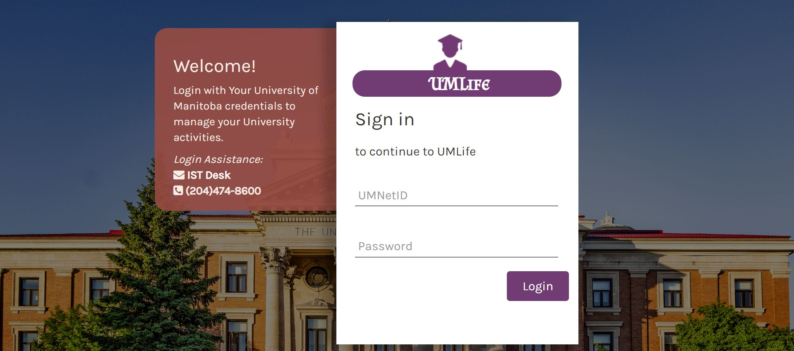
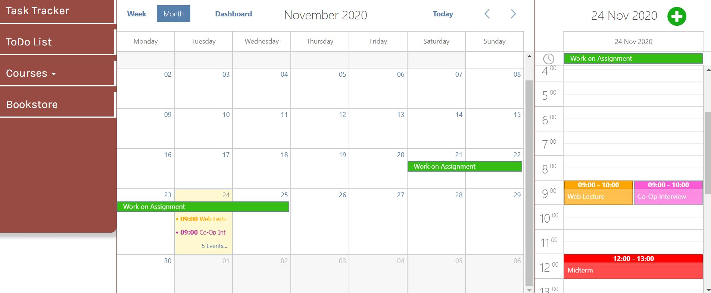
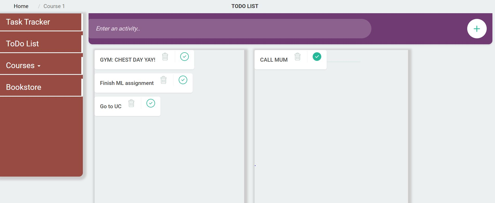
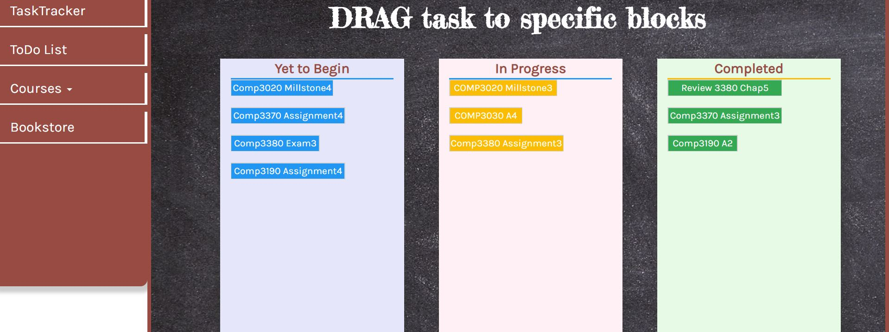

# UMLife

## Introduction
UMLife is a web application that helps to ease the stress on student, by helping them manage their time while at the University of Manitoba. It is a task manager that has calendars with multiple views to help students schedule there task. It also has a Todo list that students can create new tasks and a task tracker to help check progress.

This project is a horizontal prototype, meaning that we only focused on completing some features. It was essentially used to get feedback from students about the feasibillity. It also followed HCI techniques learnt during the the course.

## Screenshots

### Login page

### Overview page

### To-do List

### Task Tracker

## Contributors
- Olayinka Adelakun
- Mawo Emmanuel Mommoh
- CJ Amanabu
- Yuan Ding

